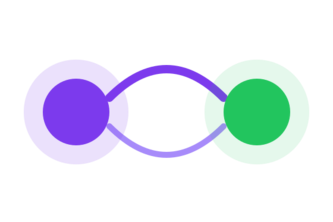
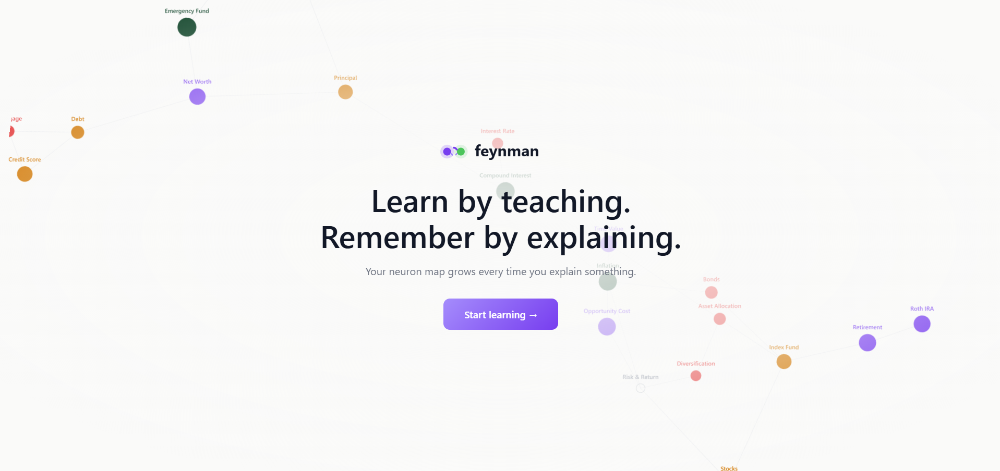
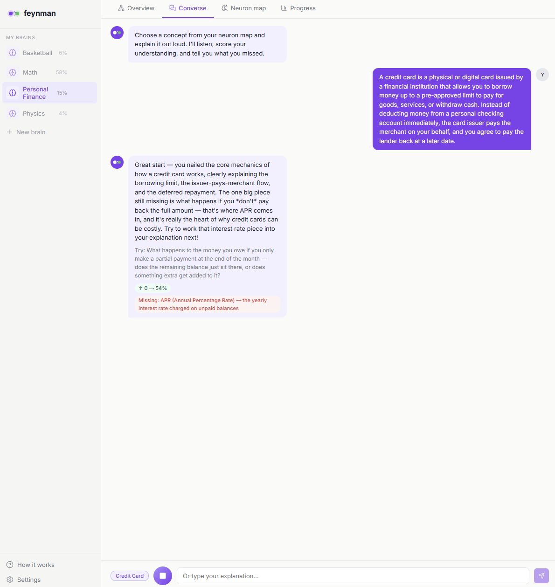
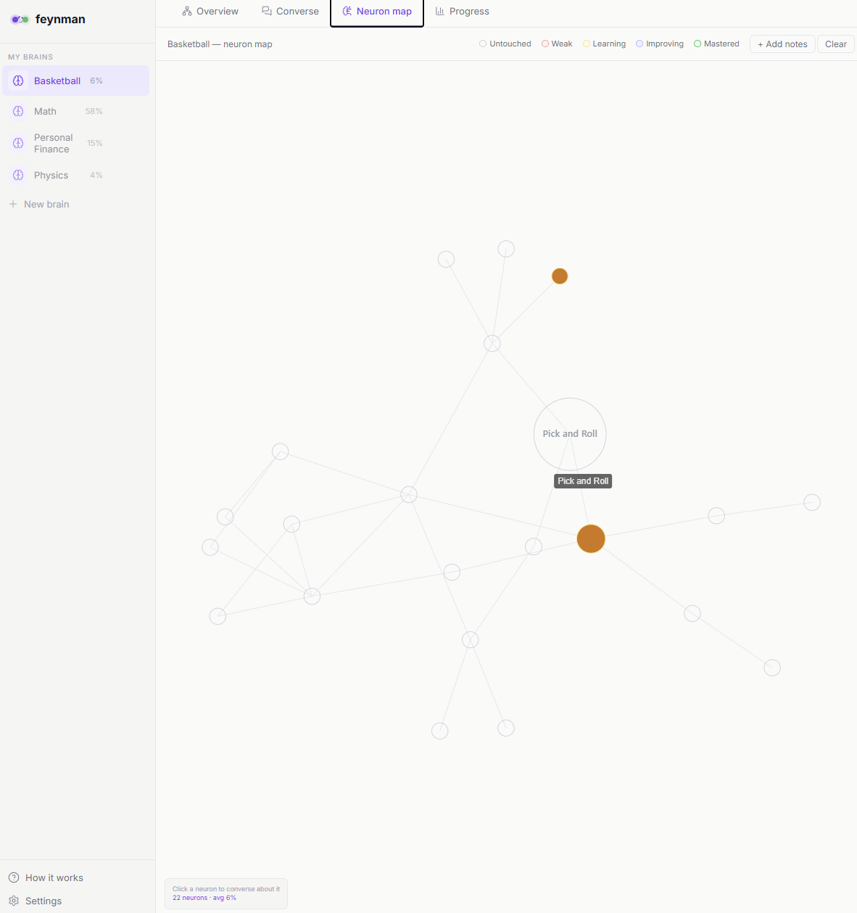
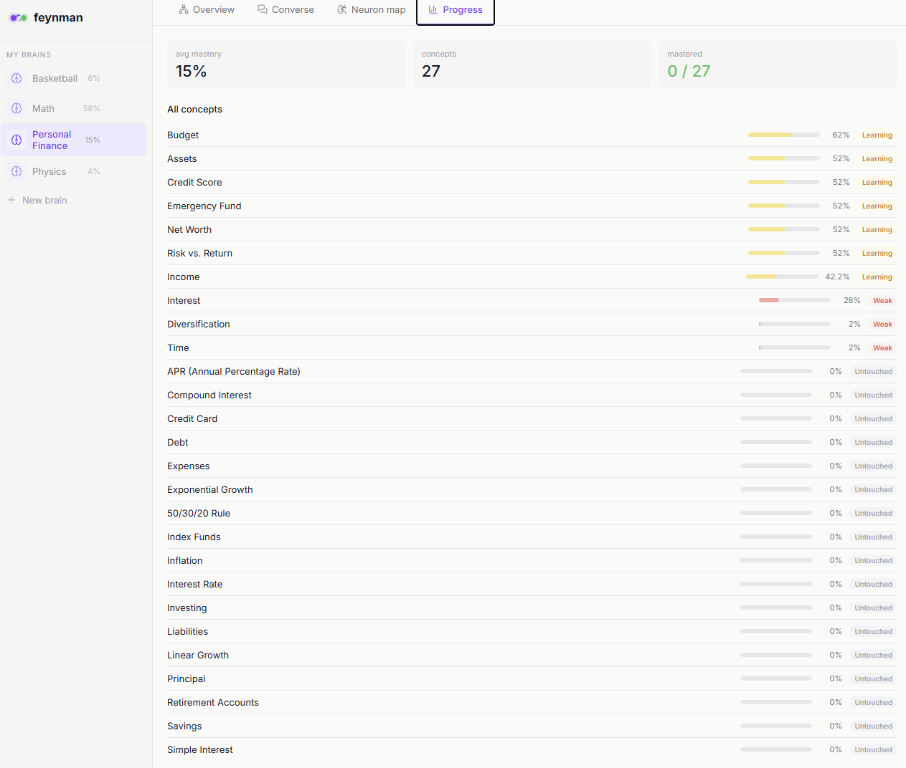

# UC Berkeley AI Hackathon 2026 Submission

  

<i>Build your knowledge graph. Master it by teaching it back.</i>

# Feynman
Feynman is a **voice-first learning agent**. You paste your notes, give it an initial framework of what you want to learn, and it builds a living **knowledge graph** where every node is a concept colored by how well you understand it. Pick a concept, hit record, and explain it out loud — Feynman scores what you got right, what you missed, and what misconceptions crept in, then re-colors the node instantly.

  <a href="https://feynman-pi.vercel.app/"><b>🚀 Try it out</b></a>
  &nbsp;·&nbsp;
  <a href="https://devpost.com/software/feynman-s6h3ke"><b>📝 Devpost</b></a>
  &nbsp;·&nbsp;
  <a href="https://docs.google.com/presentation/d/1Phhx9FkcMEhtW2xGULLAx6HPz6B2Rzj15hy87e_OIMo/edit?usp=sharing"><b>📄 Slides</b></a>
  &nbsp;·&nbsp;
  <a href="https://www.youtube.com/watch?v=veUY0hJSdsw"><b>🎥 Demo</b></a>

---

## App Overview

<table>
  <tr>
    <td align="center">
      
       
      <b>Start</b>
       
      Land, drop in your notes, and start learning
    </td>
    <td align="center">
      
       
      <b>Converse</b>
       
      Explain a concept out loud; get scored, grounded feedback
    </td>
  </tr>
  <tr>
    <td align="center">
      
       
      <b>Neuron Map</b>
       
      Your knowledge as a graph, nodes colored by mastery
    </td>
    <td align="center">
      
       
      <b>Progress</b>
       
      Track mastery per concept across every session
    </td>
  </tr>
</table>

---

## Inspiration

I've always been searching for more effective ways to learn. I've tried pomodoro, blurting, and plenty of other methods, but none of them felt as effective as one idea I kept coming back to: teaching is the most effective way to learn. When you have to explain something to someone else, you find out very quickly what you actually know and what concepts you need to spend more time on.

That led me to the Feynman technique. If you can't explain a concept in plain language, you don't deeply understand it. The moment you try to teach something out loud, every gap in your knowledge surfaces immediately. It's hard to fake your way through an explanation.

I'd also always wanted to visualize the connections between topics and actually see which areas I needed to build up before tackling harder concepts. So I combined the two ideas into one tool — something that makes you explain to demonstrate mastery, listens to how you learn, and visualizes the entire process.

---

## What does Feynman do?

Feynman is a voice-first learning agent. You paste your notes, give it an initial framework of what you want to learn, and it builds a living knowledge graph where every node is a concept colored by how well you understand it.

When you're ready to study, pick a concept, hit record, and explain it out loud. Feynman transcribes your explanation, searches your knowledge graph for related concepts, and passes everything to Claude. Claude scores what you got right, what you missed, and what misconceptions crept in. Deepgram speaks the feedback back to you. The node re-colors instantly.

The more you use it, the smarter it gets. Feynman tracks your misconceptions, your progress, and how you like to be taught across sessions. It adapts to your learning style.

---

## How I built it

**Frontend:** Built with Next.js. The neuron map is rendered using react-force-graph-2d, with nodes colored by mastery state. Untouched concepts appear hollow. The more you study a concept, the more it fills in.

**Voice:** Deepgram STT (nova-3) transcribes everything you say. Deepgram TTS speaks the feedback back. The whole experience is a conversation. You talk, it responds.

**Reasoning:** Claude reads your notes and pulls out the key concepts and how they connect. When you converse with Feynman, it evaluates your explanation against what you've actually studied; it grounds itself in your knowledge graph.

**Embeddings:** Voyage AI embeds every concept and spoken transcript into vectors, making it possible to find concepts that are related in meaning across your entire neuron map.

**Memory:** Redis Cloud with Search and Query is where everything lives. When you speak, your transcript is embedded and KNN-searched against your knowledge graph to find the most relevant concepts. Mastery scores, misconceptions, and learning preferences all persist across sessions in long-term memory. It's the agent's brain.

> 📖 For setup, env vars, API routes, and the full architecture, see **[DEVELOPMENT.md](./DEVELOPMENT.md)**.

---

## Challenges I ran into

**Redis vector search setup.** Getting Redis vector search working was one of the bigger hurdles. Not all Redis tiers include the Search and Query module, which took time to figure out. On top of that, embeddings have to be passed as a Float32Buffer, not a raw JS array. Passing the wrong type returns nothing silently, which made it fairly annoying to debug.

**react-force-graph-2d in Next.js.** The library uses browser APIs that don't exist on the server, which crashes Next.js on startup. It needs to be dynamically imported with `ssr: false`, otherwise the app just white-screens with no useful error message.

**Consistent JSON from Claude.** The evaluation prompt needs to return structured JSON every time or the frontend breaks. Getting Claude to stay consistent while still producing useful feedback took many iterations.

**Voyage AI embeddings.** Anthropic has no native embeddings endpoint. I assumed it worked like other providers, but their documentation points to Voyage AI as the recommended provider, so I went with that.

---

## Accomplishments that I'm proud of

The core loop working end-to-end is what I'm most proud of. You speak, Feynman retrieves your knowledge graph from Redis, Claude evaluates against that context, Deepgram speaks the feedback back, and the node re-colors. The whole interaction feels responsive and highly curated to you.

I'm also proud of building out the memory system and figuring out how to have the agent actually learn from your responses over time. Getting the relationship between concepts to inform how Claude evaluates you, and having that context persist and grow across sessions, was one of the more rewarding features to get working.

---

## What I learned

This was my first project connecting multiple API endpoints together and working with Redis, and I felt like I was ambitious with the scope. Getting all the pieces talking to each other reliably, managing latency between Deepgram STT and Claude, keeping API keys server-side, took far more time and thinking than I expected.

I also learned that an idea like the Feynman technique is structured really well for an AI interaction loop. A naturally structured process with clear inputs and outputs gives you a lot to work with, and plugging the right APIs into each step of that loop is what brought the ideas into a working POC.

---

## Feynman's Future

**Cross-brain transfer learning.** When a new concept enters one brain, vector search across all brains finds semantically similar mastered concepts. Claude draws bridge edges with analogies like "you already understand exponential growth from math. Compound interest is the same idea applied to money."

**Concept dependency graph.** Prerequisite relationships between concepts, so Feynman can tell you "your understanding of compound interest is held back by a shaky grasp of principal. Reinforce that concept first."

**Deeper learning profile.** The system already detects misconception patterns and confidence gaps across sessions. The next step is surfacing these as a visible Learning Profile node on the graph, showing you a map of not just what you know but how you think.

**Spaced repetition.** Implementing a forgetting curve per concept, where mastery slowly decays over time if a concept goes unreviewed, and scheduling teachback sessions around that decay, to keep concepts fresh.

---

## Tech Stack

**Next.js** · **react-force-graph-2d** · **Claude** · **Deepgram** (STT nova-3 + TTS) · **Voyage AI** (embeddings) · **Redis Cloud** (Search & Query) · **Vercel**
