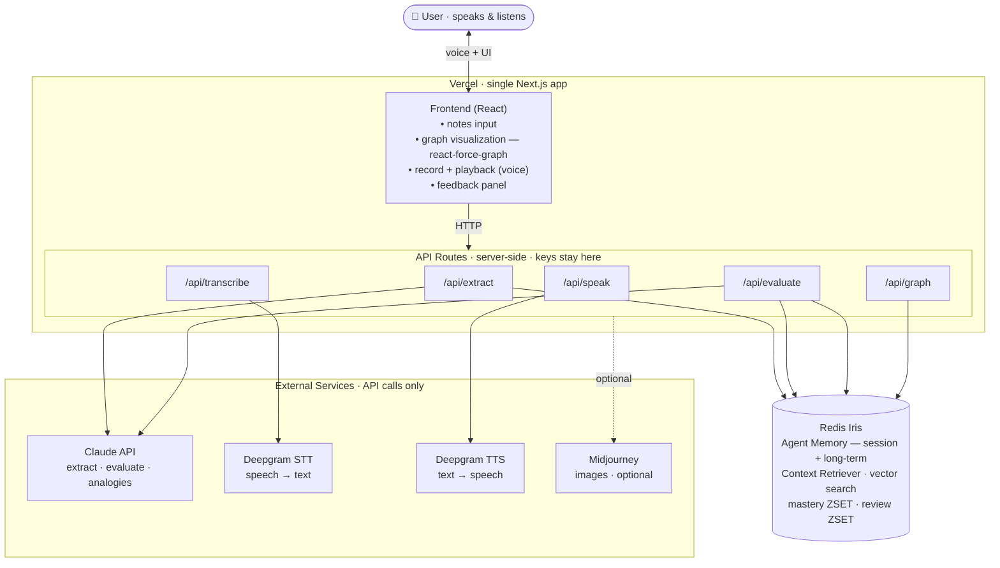
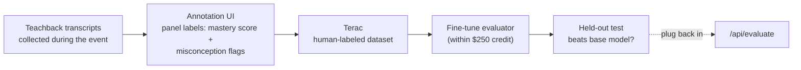

# Feynman — a living learning brain that helps you master topics by teaching them back

> *Working title. "Feynman" nods to the Feynman technique: you only really know something when you can explain it out loud. Swap freely — Synapse, Cortex, Echo, and Recall all fit.*

## One-liner

Feynman is a voice-first learning agent. You talk to it, it builds a living knowledge graph of what you're studying, and it makes you **teach concepts back out loud** — then it listens, judges how well you actually understand, speaks feedback back, and updates a persistent memory of your mastery. The map of your mind gets smarter every session.

## The problem

Most study tools test *recall* (flashcards, quizzes). They don't test *understanding*, they don't show you the shape of what you know, and they forget you the moment you close the tab. Learners can't see where their knowledge is solid, where it's shaky, or how new topics connect to things they already understand.

## The solution

A topic-segmented "brain" that grows as you learn. You feed it notes and explain things out loud; it extracts concepts and how they relate, runs **two-way voice teachback sessions**, scores your actual comprehension, and *remembers everything* across sessions — strong spots, weak spots, your misconceptions, and how you personally like to be taught.

---

## Prize strategy: which tracks we're targeting and why we fit

We're going after **three** tracks. The first two are baked into the core product, so a single polished build competes for both. The third is a separable reach milestone.

| Track | How Feynman targets it |
|-------|------------------------|
| **Redis — Using Redis Beyond Caching / Creativity / Technical Implementation** | Redis isn't a cache here — it's the **agent's memory and context engine**, built on **Redis Iris** (Agent Memory + Context Retriever + vector search). The learning graph *is* long-term agent memory; vector search powers cross-brain transfer learning and grounds every evaluation in retrieved context. Hits all three criteria: clearly beyond caching, a genuinely novel use, and a non-trivial architecture. |
| **Deepgram — Best Use of Deepgram** | Voice is the *interaction model*, not a feature. You **speak** your explanation (Deepgram STT) and the tutor **speaks back** (Deepgram TTS) — a real two-way voice conversation where removing voice removes the product. Directly answers "how essential is voice." |
| **Terac — Best Use of Terac (REACH)** | We turn the evaluation step into an annotation task: collect human mastery labels on teachback transcripts through Terac's panel, fine-tune a specialized evaluator, and show it beats the base model on held-out explanations. Separable from the core build — only attempted if Tiers 1–2 are solid. |

The synergy is the pitch: **a voice-native learning agent whose memory lives in Redis.** Deepgram is how you talk to it; Redis Iris is what makes it remember and reason about you over time.

---

## Core concept: topic "brains"

A user can spin up multiple **brains**, one per domain (Math, Personal Finance, Biology…). Each brain is its own knowledge graph. This keeps domains clean *and* sets up the standout feature: **transfer learning**, where a concept you already mastered in one brain (exponential growth in Math) is surfaced — via vector similarity — to explain a new one in another (compound interest in Personal Finance).

### What a brain contains

- **Concept nodes** — name, short summary, a live mastery score (0–100), and an embedding vector
- **Edges** — "relates to / depends on / is an example of" links, including cross-brain bridges
- **Mastery state** — learned / shaky / weak / untested, derived from the score
- **Memory** — your misconceptions, past explanations, and how you like to be taught, persisted across sessions

---

## How it works (the core loop)

1. **Ingest** — User pastes notes or speaks a question. **Claude** extracts concepts + relationships as structured JSON; concepts are embedded and written to **Redis** memory.
2. **Visualize** — The graph renders force-directed (Obsidian-style), nodes colored by mastery.
3. **Teachback (speak)** — User picks a node and explains it out loud. The browser records audio.
4. **Transcribe** — **Deepgram STT** converts the explanation to text.
5. **Retrieve context** — **Redis Iris Context Retriever / vector search** pulls the relevant prior concepts, past misconceptions, and the user's learning preferences.
6. **Evaluate** — **Claude**, grounded in that retrieved context, scores the explanation against a rubric: what's correct, what's missing, what's a misconception. Returns mastery score + weak spots + next question.
7. **Speak back** — **Deepgram TTS** voices the feedback, so the session is a real conversation.
8. **Remember** — **Redis** updates the mastery score, stores the misconception, and schedules the next review. The graph re-colors instantly.

This loop — *speak → it understands you → it answers out loud → the map changes* — is the demo's wow moment. **Build this loop first and make it tight.**

---

## Tech stack

| Tool | Role | Notes |
|------|------|-------|
| **Claude (Anthropic)** | Concept extraction, comprehension evaluation, question generation, feedback, cross-brain analogies | The reasoning core. Most build time goes into the evaluation prompt. |
| **Deepgram** | **STT** (you speak) + **TTS** (tutor speaks back) → two-way voice | STT is non-negotiable. TTS is cheap and makes voice *essential*, not tacked on. Voice Agent API is the ambitious upgrade. |
| **Redis Iris** | **Agent Memory** (session + long-term, vector-backed) + **Context Retriever** — the brain's memory & semantic recall | This is the "beyond caching" story. See the Redis section below. |
| **Terac** | Human annotation of teachback transcripts → fine-tune a specialized evaluator | **REACH only.** Separate workstream; see the Terac section. |
| **Midjourney** | Concept illustrations | **Slides / stretch.** Image gen is slow to wire up live; pre-generate for the deck. |

### Redis: the agent's memory, not a cache

This is the heart of the Redis pitch, so be deliberate about it.

First, a correction worth knowing: **RedisGraph is dead** (end-of-life Jan 31, 2025; removed from Redis Stack). Don't build on it. The modern Redis path for exactly this kind of app is **Redis Iris** — the context-and-memory platform Redis launched in May 2026 for AI agents. It gives you three things that map onto Feynman almost one-to-one:

- **Agent Memory** — session memory (the live teachback session, TTL'd) *and* long-term memory across sessions (your mastery, misconceptions, preferences), backed by vector search. **Your "living learning brain" literally is long-term agent memory.**
- **Context Retriever** — pulls the relevant slice of what you've learned to ground each evaluation, so Claude judges your explanation against *your* history, not a blank slate.
- **Vector search** — semantic recall over concepts.

Three vector-search use cases make this technically sophisticated *and* creative — not a cache:

1. **Cross-brain transfer learning** — embed every concept; when a new concept enters Brain B, vector-search across *all* brains for semantically similar mastered concepts and draw "bridge" edges with Claude-written analogies. (This is the feature that used to be hard — vectors make it real.)
2. **Context-grounded evaluation** — retrieve relevant prior concepts + past misconceptions before scoring a teachback.
3. **Note deduplication** — vector-match new notes to existing concepts so the graph doesn't fragment into duplicates.

Underneath, the structured side of memory still uses core Redis structures, and the sorted sets remain the unsung heroes:

```
brain:{userId}:{brainId}            → hash    (brain metadata)
concept:{brainId}:{conceptId}       → hash    (name, summary, status)  + vector index
edges:{brainId}:{conceptId}         → set     (adjacency list, incl. cross-brain bridges)
mastery:{brainId}                   → ZSET    (member=conceptId, score=0–100)
review:{brainId}                    → ZSET    (member=conceptId, score=nextReviewTimestamp)
memory:{userId}                     → long-term agent memory (prefs, misconceptions)
session:{sessionId}                 → session memory (live teachback, TTL)
```

- `mastery:{brainId}` — `ZRANGE` gives the weakest concepts instantly → **Refresher Mode**.
- `review:{brainId}` — `ZRANGEBYSCORE 0 now` gives everything due → **spaced repetition** for free.

**Pragmatic note for 24h:** lead with Redis Iris Agent Memory + vector search — it's exactly what the judges want to see. If the managed Iris integration proves fiddly under time pressure, a hand-rolled equivalent (RediSearch vector index + the key schema above) still demonstrably uses Redis *beyond caching* and qualifies. Either way, do **not** add a second database.

---

## Architecture

One Next.js app (deployed on Vercel) serves both the frontend and the server-side API routes that talk to the services. API keys live only in those routes — the browser never touches Redis, Claude, or Deepgram directly.



**The core loop traced through the diagram:**

1. Notes in → **`/api/extract`** → Claude pulls concepts + edges, embeds them → **Redis Iris** stores them as memory.
2. **`/api/graph`** reads Redis → **react-force-graph** renders the map, colored by mastery.
3. User speaks → audio to **`/api/transcribe`** → **Deepgram STT** → text.
4. **`/api/evaluate`** → Context Retriever pulls relevant memory from Redis → Claude scores → new mastery + misconception written back to Redis.
5. **`/api/speak`** → **Deepgram TTS** voices the feedback; the node re-colors. That moment is the demo.

> **Hosting recap:** Next.js → **Vercel** (free tier, deploy from GitHub). Redis → **Redis Cloud / Iris** (you have credits via the prize). Claude, Deepgram, Midjourney → API calls only.

---

## Feasibility within 24 hours

The core idea is very plausible. The risk is scope. The pieces (transcribe, prompt an LLM, vector-search in Redis, draw a force graph, TTS) are all well-trodden — the danger is spreading thin. Tiers below are ordered so that **finishing Tier 1 alone competes for both Redis and Deepgram.**

### Tier 1 — MVP (commit to all of this; this is what wins Redis + Deepgram)
- **One brain**, namespaced by `brainId` from the start (so multi-brain is a toggle later, not a refactor).
- **Notes → graph**: Claude extracts concepts + edges → embed → store in Redis Iris memory.
- **Graph visualization**: off-the-shelf — **react-force-graph** / **Cytoscape.js** / **vis-network**. Don't hand-roll d3. Color by mastery.
- **Voice teachback loop**: record → **Deepgram STT** → **context-grounded** Claude eval (retrieve from Redis) → **Deepgram TTS** speaks feedback → Redis memory update → re-color. *(STT is non-negotiable; TTS is cheap and is what makes voice essential — keep it in Tier 1.)*
- **One vector-search use in the demo** — context-grounded evaluation at minimum. This is the proof point that Redis is beyond caching.

### Tier 2 — Strong stretch (pick 1–2 once Tier 1 is solid, ~hour 14)
- **Cross-brain transfer learning via vector search** — the flashiest feature *and* doubles down on the Redis story. High demo value.
- **Refresher Mode** — `ZRANGE mastery:{brainId}`. Nearly free given the data model.
- **Preferences memory** — store in long-term memory, inject into Claude's prompt ("it remembers I like examples first").
- **Voice Agent API** — upgrade the two-way voice into a fully conversational tutor, if STT+TTS is already smooth.
- **Multi-brain** switching.

### Tier 3 / Reach
- **Terac fine-tuning track** (see next section) — the big reach; only with a spare person/spare time.
- **Current-world updates** — web search + freshness. Talking point, low priority.
- **Midjourney live** — slow plumbing; pre-generate for slides instead.

### Things that will quietly eat your time
- **Browser audio capture** (`getUserMedia` → record blob → POST). Use Deepgram pre-recorded, not live streaming.
- **The evaluation prompt.** Consistent, structured rubric scoring is the product. Use structured JSON output + a fixed rubric. Budget real time.
- **Iris integration.** Spike it in the first 2 hours; fall back to hand-rolled RediSearch vector if it fights you.
- **Graph re-render.** Update node colors without a full re-layout, or the graph looks broken on stage.

---

## Terac reach milestone — annotate, fine-tune, beat the base model

Terac is a different *kind* of task (data + fine-tuning), so treat it as a parallel, separable workstream. The clean fit: **the evaluation step is where a specialized model would help.**



**Plan:** build a lightweight annotation environment where Terac's panel labels teachback transcripts — a mastery score (0–100) and a misconception tag. Collect the dataset live through Terac, fine-tune a small evaluator on it, and show it scores comprehension more accurately than the base model on explanations it never saw.

**Why it fits the judging:**
- *Improvement on unseen examples (50%)* — hold out a transcript set; report base vs. fine-tuned accuracy/agreement-with-humans.
- *Annotation UX (30%)* — your teachback transcripts are a natural, fun thing to label; show the concept and the spoken explanation side by side.
- *Smart use of the $250 credit (20%)* — label the *informative* cases (disagreements, edge explanations), not random ones.

**Be honest about the risk:** fine-tuning + a credible holdout eval is a project on its own. It needs a dedicated person and enough annotations to move the needle. Only commit once Tier 1 is demonstrably working — otherwise it sinks the core demo.

---

## Suggested 24-hour plan

| Hours | Focus |
|-------|-------|
| 0–2 | Lock scope. Scaffold Next.js on Vercel. "Hello world" each service: Claude, Deepgram STT, Deepgram TTS, Redis Iris. **Spike Iris early** so you know whether to fall back. |
| 2–6 | Notes → Claude extraction → embed → Redis memory. Get the data + vector model right. |
| 6–10 | Graph visualization reading from Redis, colored by mastery. |
| 10–16 | The voice teachback loop end-to-end: record → STT → context-grounded eval → TTS → memory update → re-color. **This is the project.** |
| 16–19 | Feedback panel + reliability on the eval prompt. Add the one vector-search demo moment. |
| 19–22 | One Tier-2 feature (transfer learning has the best demo payoff). Then stop adding. |
| 22–24 | Demo script, slides, rehearse the live voice flow twice (audio always breaks on stage — test it). |

*Parallel track (if you have a 4th person):* Terac annotation UI from hour ~4, collecting labels by hour ~12, fine-tune + holdout eval by hour ~20.

### Suggested role split
- **Backend/memory:** Redis Iris, vector search, Claude wiring, the eval prompt.
- **Voice/frontend:** Deepgram STT+TTS, recording/playback UI, graph viz, feedback panel.
- **Glue/PM/demo:** integration, demo script, slides, scope discipline.
- **(4th, optional) Terac:** annotation app, dataset, fine-tune, holdout eval.

---

## Demo script (the story that sells it)

1. Open the **Personal Finance** brain. Paste a few lines of notes. The graph builds itself.
2. Click **Compound Interest**. Hit record and *speak* your explanation out loud — *deliberately leave out the time component.*
3. Feynman transcribes you, retrieves what you already know, and **speaks back**: "You nailed principal and rate, but you skipped how time compounds." The node dims to "shaky."
4. Point at the **bridge edge** to **Exponential Growth** in your Math brain — found by vector similarity: "you already understand this from algebra."
5. Re-explain with the fix. Score jumps, node turns green, the map visibly got smarter — and it'll remember this next session.

That arc — *you talk, it understands you, it talks back, and its memory of your mind updates* — is the whole pitch. It's also, not by accident, exactly what the Redis and Deepgram judges are looking for. Protect it above all else.
