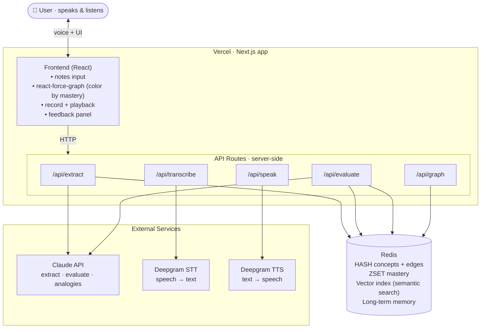

# Feynman — a living learning brain that helps you master topics by teaching them back

> *"Feynman" nods to the Feynman technique: you only really know something when you can explain it out loud.*

## One-liner

Feynman is a voice-first learning agent. You talk to it, it builds a living knowledge graph of what you're studying, and it makes you **teach concepts back out loud** — then it listens, judges how well you actually understand, speaks feedback back, and updates a persistent memory of your mastery. The map of your mind gets smarter every session.

## The problem

Most study tools test *recall* (flashcards, quizzes). They don't test *understanding*, they don't show you the shape of what you know, and they forget you the moment you close the tab. Learners can't see where their knowledge is solid, where it's shaky, or how new topics connect to things they already understand.

## The solution

A "brain" that grows as you learn. You feed it notes; it extracts concepts and relationships. You explain things out loud; it listens, retrieves what you've already studied, scores your comprehension, and speaks feedback back — updating your mastery score for that concept in real time. The graph re-colors. The map of your knowledge gets smarter every session.

---

## Prize strategy

| Track | How Feynman targets it |
|-------|------------------------|
| **Redis — Beyond Caching** | Redis is the agent's semantic memory. When a user explains a concept, their transcript is embedded and vector-searched against Redis to retrieve related concept nodes. Those retrieved concepts ground Claude's evaluation — proving Redis is a semantic memory/vector database, not fast temporary storage. |
| **Deepgram — Best Use of Deepgram** | Voice is the *interaction model*, not a feature. You **speak** your explanation (Deepgram STT) and the tutor **speaks back** (Deepgram TTS) — a real two-way voice conversation. Remove voice and the core learning loop doesn't exist. |

The pitch: **a voice-native learning agent whose memory lives in Redis.** Deepgram is how you talk to it; Redis is what makes it understand you.

---

## Scope for this build: one Finance brain

**MVP target:** a single **Personal Finance** brain. The data model is namespaced by `brainId` from day one, so adding more brains later is a config toggle — not a refactor.

### What the brain contains

- **Concept nodes** — name, short summary, mastery score (0–100, initialized at 0%), and an embedding vector
- **Edges** — typed relationships: `relates_to`, `depends_on`, `is_example_of`
- **Mastery state** — derived from score: `untested` (0%) → `weak` (1–39%) → `shaky` (40–69%) → `learned` (70–100%)
- **Memory** — past explanations, misconceptions, stored across sessions in Redis

---

## Core loop (build this first, make it tight)

```
Notes in
  → Claude extracts concepts + edges as JSON
  → embed each concept → store in Redis (hash + vector index)
  → react-force-graph renders nodes colored by mastery

User picks a node → clicks Record → speaks their explanation
  → Deepgram STT → transcript text
  → embed transcript → Redis vector search → retrieve semantically related concept nodes
  → Claude evaluates: grounded in retrieved nodes, scores explanation against rubric
      → returns { masteryScore, correct, missing, misconceptions, followUpQuestion }
  → Deepgram TTS speaks the feedback out loud
  → Redis updates mastery score for the node
  → graph node re-colors instantly
```

This loop — *speak → it understands you → it talks back → the map changes* — is the demo. **Protect it above everything else.**

---

## Feature 1: Notes → Graph

**What it does:** User pastes raw notes into a text field. Claude extracts structured concepts and relationships.

**Claude extraction prompt (structured JSON output):**
```
Given these notes, extract a list of concepts and how they relate.
Return ONLY valid JSON:
{
  "concepts": [
    { "id": "compound_interest", "name": "Compound Interest", "summary": "..." }
  ],
  "edges": [
    { "from": "compound_interest", "to": "principal", "type": "depends_on" }
  ]
}
```

**After extraction:**
- Embed each concept summary (OpenAI `text-embedding-3-small` or Anthropic embeddings)
- Write to Redis:
  ```
  HSET concept:{brainId}:{conceptId}  name "..."  summary "..."  masteryScore 0  status "untested"
  ```
- Add to vector index for semantic search
- Set in mastery ZSET: `ZADD mastery:{brainId} 0 {conceptId}`

**API route:** `POST /api/extract`
```ts
// body: { brainId: string, notes: string }
// 1. Call Claude → parse JSON concepts + edges
// 2. For each concept: embed → HSET + vector index + ZADD mastery
// 3. For each edge: SADD edges:{brainId}:{fromId} {toId}:{type}
// Returns: { concepts[], edges[] }
```

---

## Feature 2: Graph Visualization

**Library:** `react-force-graph` (2D). Do not hand-roll D3.

**Node color by mastery:**
```ts
const masteryColor = (score: number) => {
  if (score === 0)   return '#6b7280' // gray    — untested
  if (score < 40)    return '#ef4444' // red     — weak
  if (score < 70)    return '#f59e0b' // amber   — shaky
  return                    '#22c55e' // green   — learned
}
```

**Node data shape fed to react-force-graph:**
```ts
type ConceptNode = {
  id: string
  name: string
  summary: string
  masteryScore: number   // 0–100
  status: 'untested' | 'weak' | 'shaky' | 'learned'
  val: number            // node size — scale with masteryScore
}
```

**Critical:** update node color on mastery change **without triggering a full re-layout**. Use react-force-graph's `nodeColor` prop as a live-computed function — don't force a data reload.

**API route:** `GET /api/graph?brainId=finance`
```ts
// Reads all concept hashes + edges from Redis
// Returns: { nodes: ConceptNode[], links: Edge[] }
```

---

## Feature 3: Voice Teachback Loop (the product)

This is the most important feature. Every design decision should protect this flow.

### 3a. Record (browser)
```ts
// getUserMedia → MediaRecorder → collect chunks → Blob
// On stop: POST blob to /api/transcribe
const startRecording = async () => {
  const stream = await navigator.mediaDevices.getUserMedia({ audio: true })
  const recorder = new MediaRecorder(stream)
  const chunks: Blob[] = []
  recorder.ondataavailable = e => chunks.push(e.data)
  recorder.onstop = () => {
    const blob = new Blob(chunks, { type: 'audio/webm' })
    submitExplanation(blob)
  }
  recorder.start()
}
```

Use **pre-recorded** (record → stop → POST), not live streaming. Simpler and more reliable.

### 3b. Transcribe — `POST /api/transcribe`
```ts
// body: FormData with audio blob
// Calls Deepgram STT pre-recorded endpoint
const { result } = await deepgram.listen.prerecorded.transcribeFile(buffer, {
  model: 'nova-3',
  smart_format: true,
})
const transcript = result.results.channels[0].alternatives[0].transcript
// Returns: { transcript: string }
```

### 3c. Retrieve context — vector search in Redis
```ts
// /api/evaluate step 1: embed the transcript, search Redis for related concepts
const queryEmbedding = await embed(transcript)

// FT.SEARCH on the vector index — returns top-k semantically similar concept nodes
const relatedConcepts = await redis.ft.search(
  'idx:concepts',
  `*=>[KNN 5 @embedding $vec AS score]`,
  { PARAMS: { vec: queryEmbedding }, DIALECT: 2 }
)
// These retrieved nodes ground the evaluation — THIS is the Redis beyond-caching proof point
```

**Why this matters for the Redis prize:** the user's spoken explanation is embedded and searched against the learning graph. Claude then evaluates the explanation *in the context of what the user has actually studied* — not from a blank slate. Redis is doing semantic memory retrieval, not caching.

### 3d. Evaluate — `POST /api/evaluate`
```ts
// body: { conceptId, transcript, brainId }
// 1. Embed transcript → vector search Redis → retrieve related concept nodes (step 3c)
// 2. Fetch target concept: HGETALL concept:{brainId}:{conceptId}
// 3. Fetch past misconceptions from session/long-term memory
// 4. Call Claude with structured prompt:

const systemPrompt = `
You are a Socratic tutor evaluating a student's verbal explanation of a concept.
You will be given:
- The target concept the student was asked to explain
- Related concepts from their knowledge graph (retrieved by semantic search)
- Their spoken explanation transcript
- Any known past misconceptions

Evaluate against this rubric:
1. Core definition accuracy (0–30 pts)
2. Key relationships and dependencies mentioned (0–30 pts)  
3. Absence of misconceptions (0–20 pts)
4. Ability to connect to related concepts (0–20 pts)

Return ONLY valid JSON:
{
  "masteryScore": <0-100>,
  "correct": ["..."],
  "missing": ["..."],
  "misconceptions": ["..."],
  "feedbackMessage": "<2-3 sentences spoken aloud to the student>",
  "followUpQuestion": "<one question to push deeper>"
}
`

// 5. Write results back to Redis:
//    HSET concept:{brainId}:{conceptId} masteryScore {score} status {derived}
//    ZADD mastery:{brainId} {score} {conceptId}
//    Store misconceptions in long-term memory
// Returns: EvaluationResult
```

### 3e. Speak feedback — `POST /api/speak`
```ts
// body: { text: string }
// Calls Deepgram TTS
const response = await deepgram.speak.request(
  { text: feedbackMessage },
  { model: 'aura-asteria-en' }
)
// Returns audio stream → play in browser
// Returns: audio buffer
```

**UX:** the moment the audio plays and the node re-colors is the demo's wow moment. The graph updates must be near-instant on the frontend — optimistically update the node color as soon as `/api/evaluate` returns, before TTS finishes.

---

## Feature 4: Cross-Brain Transfer (Framework — build after MVP is solid)

**Concept:** when evaluating or explaining a Finance concept, the system vector-searches *across brains* to find semantically similar mastered concepts. Claude uses those analogies to explain Finance in familiar terms.

Example: explaining "Compound Interest" → vector search finds "Exponential Growth" from a Math brain → Claude says *"think of it like the exponential functions you already know from algebra."*

**Data model (namespaced from day one):**
```
concept:{userId}:{brainId}:{conceptId}  → hash + vector index
```

**Cross-brain query:**
```ts
// Search across ALL brains for this user, not just the current one
const crossBrainResults = await redis.ft.search(
  'idx:all-concepts',           // index spans all brainIds for this user
  `*=>[KNN 3 @embedding $vec AS score]`,
  { PARAMS: { vec: queryEmbedding }, FILTER: `@userId:{${userId}}`, DIALECT: 2 }
)

// Filter out nodes from current brain → these are transfer candidates
const transferConcepts = crossBrainResults.filter(r => r.brainId !== currentBrainId)
```

**Inject into evaluation prompt:**
```
The student has mastered these related concepts in other subjects:
- "Exponential Growth" (Math brain, mastery: 85%) — definition: ...

Use these as analogical bridges in your feedback where helpful.
```

**Bridge edges in the graph:** render cross-brain connections as dashed edges with a distinct color. These appear on the Finance graph pointing to "(Math) Exponential Growth." Click to expand.

**When to build:** scaffold the namespacing on day one. Wire the cross-brain query after the core teachback loop is working end-to-end.

---

## Redis key schema

```
brain:{userId}:{brainId}            → HASH   (name, createdAt)
concept:{userId}:{brainId}:{id}     → HASH   (name, summary, masteryScore, status) + vector index
edges:{userId}:{brainId}:{id}       → SET    (members: "{toId}:{type}")
mastery:{userId}:{brainId}          → ZSET   (member=conceptId, score=masteryScore 0–100)
memory:session:{sessionId}          → HASH   (live teachback context, TTL 2h)
memory:longterm:{userId}            → HASH   (misconceptions, preferences)
```

Key operations:
- `ZRANGE mastery:{userId}:{brainId} 0 3` → weakest 4 nodes (Refresher Mode, nearly free)
- `FT.SEARCH idx:concepts *=>[KNN 5 @embedding $vec]` → semantic retrieval for evaluation context
- `HSET concept:... masteryScore {n}` → mastery update after teachback

---

## API routes summary

| Route | Method | Purpose |
|-------|--------|---------|
| `/api/extract` | POST | Notes → Claude extraction → embed → Redis write |
| `/api/graph` | GET | Read all nodes + edges from Redis → graph data |
| `/api/transcribe` | POST | Audio blob → Deepgram STT → transcript |
| `/api/evaluate` | POST | Transcript → embed → Redis vector search → Claude eval → Redis update |
| `/api/speak` | POST | Feedback text → Deepgram TTS → audio |

All API keys live **only** in these server-side routes. The browser never touches Redis, Claude, or Deepgram directly.

---

## Architecture



---

## Tech stack

| Tool | Role |
|------|------|
| **Next.js** | App framework — frontend + API routes in one repo |
| **Claude (Anthropic)** | Concept extraction, comprehension evaluation, feedback generation, cross-brain analogies |
| **Deepgram STT** | Transcribe spoken explanations (`nova-3`, pre-recorded) |
| **Deepgram TTS** | Voice the tutor's feedback (`aura-asteria-en`) |
| **Redis** | Concept storage (HASH), mastery ranking (ZSET), vector index for semantic retrieval, long-term memory |
| **react-force-graph** | Graph visualization — nodes colored by mastery |
| **Vercel** | Deployment (free tier, deploy from GitHub) |

---

## 24-hour build plan

| Hours | Focus |
|-------|-------|
| 0–2 | Scaffold Next.js. "Hello world" each service: Claude API call, Deepgram STT, Deepgram TTS, Redis HSET + ZSET. Spike the vector index now — know early if you need a fallback. |
| 2–6 | `/api/extract`: notes → Claude JSON → embed → Redis. Verify data shape in Redis CLI. |
| 6–10 | `/api/graph` + react-force-graph rendering. Nodes colored by mastery (gray for 0%). Confirm re-color works without re-layout. |
| 10–16 | Voice teachback loop end-to-end: record → `/api/transcribe` (Deepgram STT) → `/api/evaluate` (vector search + Claude) → `/api/speak` (Deepgram TTS) → node re-colors. **This is the project.** |
| 16–19 | Feedback panel UI. Harden the eval prompt — consistent JSON output is the product. Test the Redis vector search retrieval visually. |
| 19–22 | Cross-brain transfer framework (if loop is solid). Otherwise: Refresher Mode via `ZRANGE` (30 min, nearly free). |
| 22–24 | Demo script. Rehearse the live voice flow twice. Audio always breaks on stage — test it. |

### Known time sinks — watch for these
- **Browser audio capture.** Use pre-recorded (record → stop → POST), not live streaming. Much simpler.
- **The evaluation prompt.** Consistent, rubric-based JSON output is the product. Budget real iteration time here.
- **Graph re-render.** Mastery update must re-color nodes without triggering a full physics re-layout.
- **Redis vector index setup.** Spike this in hour 1. If Redis Iris is fiddly, fall back to hand-rolled RediSearch — either qualifies for the prize.

### Role split
- **Backend/memory:** Redis setup, vector index, Claude prompts, `/api/extract` + `/api/evaluate`
- **Voice/frontend:** Deepgram STT+TTS, browser recording, react-force-graph, feedback panel UI
- **Glue/PM:** integration, eval prompt testing, demo script, scope discipline

---

## Demo script

1. Open the **Personal Finance** brain. Paste a few lines of notes on compound interest, principal, and interest rates. The graph builds itself — nodes appear, colored gray (untested, 0%).
2. Click **Compound Interest**. Hit record and *speak your explanation* — deliberately leave out how time affects compounding.
3. Feynman transcribes your words, **embeds the transcript, and vector-searches Redis** to retrieve the related concept nodes you've already studied. Claude evaluates your explanation grounded in that context.
4. **Feynman speaks back**: *"You nailed principal and rate — but you skipped how time is what makes compounding powerful."* The node dims from gray to amber (shaky).
5. Re-explain with the fix. Score jumps. The node turns green. The map visibly got smarter — and it'll remember this next session.

That arc — *you talk, it retrieves what you know, it talks back, the map updates* — is the whole pitch. It's exactly what the Redis and Deepgram judges want to see. Protect it above all else.
