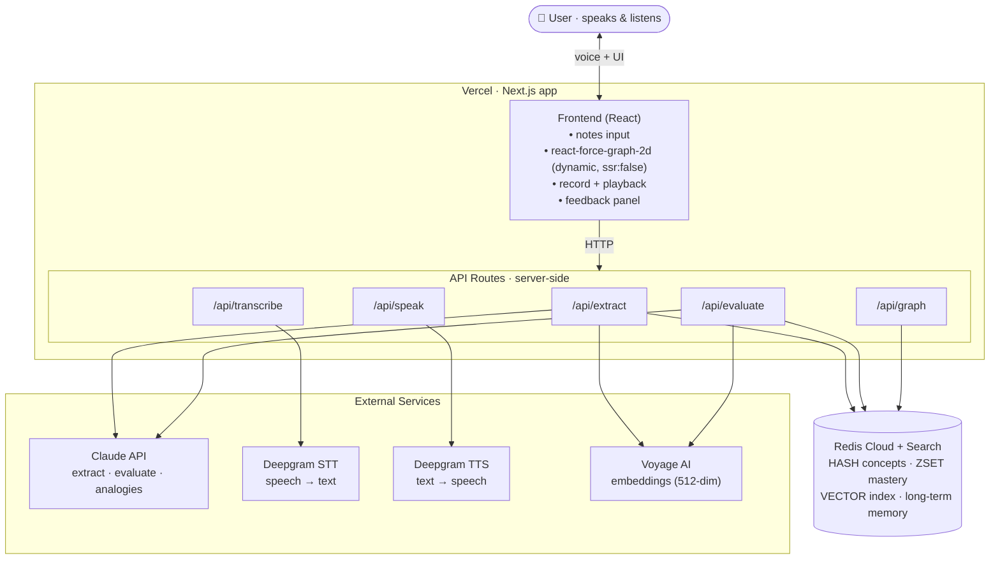

# Feynman — agent-ready build spec

> A voice-first learning agent. You talk to it, it builds a living knowledge graph of what you're studying, makes you **teach concepts back out loud**, listens, judges your understanding, speaks feedback back, and updates a persistent memory of your mastery. The map of your knowledge gets smarter every session.

This document is written to be handed to a coding agent for a one-shot build. The **Hard Rules** and **Environment & Setup** sections are non-negotiable; deviating from them reintroduces known, build-breaking bugs.

---

## ⚠️ Secrets — read first

No real API keys or connection strings appear in this document. They live **only** in a gitignored `.env.local`. Do not paste secrets into the repo, the proposal, or chat. If a secret has ever been shared in plaintext, **rotate it** (regenerate it) before the demo.

---

## Environment & Setup

### `.env.local` (placeholders — fill locally, never commit)
```bash
ANTHROPIC_API_KEY=<your-anthropic-key>
DEEPGRAM_API_KEY=<your-deepgram-key>
VOYAGE_API_KEY=<your-voyage-key>
REDIS_URL=rediss://default:<password>@<host>:<port>   # Redis Cloud, TLS (rediss://)
```

### Packages
```bash
npm install @anthropic-ai/sdk @deepgram/sdk voyageai redis react-force-graph-2d
```

### Redis requirements
- Use **Redis Cloud** (you have prize credits) with the **Search & Query (RediSearch)** capability **enabled** on the database. Vanilla Redis and Upstash do **not** support `FT.*` — vector search will silently fail without it.
- Connection uses TLS (`rediss://`); `createClient({ url: process.env.REDIS_URL })` handles this from the scheme.

### Pinned models
| Purpose | Value | Notes |
|---|---|---|
| Claude | `claude-sonnet-4-6` | Good speed/cost for extraction + evaluation |
| Embeddings | `voyage-3.5-lite`, dim **512** | Pass `outputDimension` explicitly |
| Deepgram STT | `nova-3` | **Verify against installed `@deepgram/sdk`** |
| Deepgram TTS | `aura-asteria-en` | **Verify against installed `@deepgram/sdk`** |

---

## Hard Rules — Do Not Deviate

### Rule 1 — Embeddings: Voyage, correct SDK shape
`lib/embed.ts` is the single source of truth for the embedding model **and** its dimension.
```ts
// lib/embed.ts
import { VoyageAIClient } from 'voyageai'              // ✅ named export (NOT default)

const voyage = new VoyageAIClient({ apiKey: process.env.VOYAGE_API_KEY })

export const EMBEDDING_MODEL = 'voyage-3.5-lite'
export const EMBEDDING_DIM = 512   // ← the ONLY place DIM is defined; imported everywhere

export async function embed(
  text: string,
  inputType: 'query' | 'document' = 'document',        // 'document' to store, 'query' to search
): Promise<number[]> {
  const res = await voyage.embed({
    input: [text],
    model: EMBEDDING_MODEL,
    outputDimension: EMBEDDING_DIM,                     // ✅ explicit → DIM guaranteed
    inputType,
  })
  const vec = res.data?.[0]?.embedding                  // ✅ response shape is res.data[0].embedding
  if (!vec) throw new Error('Voyage returned no embedding')
  return vec
}

export function toFloat32Buffer(embedding: number[]): Buffer {
  return Buffer.from(new Float32Array(embedding).buffer)
}
```
```ts
// ❌ NEVER — these are the three bugs to avoid
import VoyageAI from 'voyageai'        // wrong: no default export
new VoyageAI(...)                      // wrong: class is VoyageAIClient
return res.embeddings[0]               // wrong: it's res.data[0].embedding
```

### Rule 2 — Vector encoding: always a Float32 Buffer, never a raw array
**Writing a concept:**
```ts
await redis.hSet(`concept:${USER_ID}:${BRAIN_ID}:${conceptId}`, {
  name: concept.name,
  summary: concept.summary,
  masteryScore: '0',
  status: 'untested',
  userId: USER_ID,                                            // indexed as TAG (needed for filtering)
  brainId: BRAIN_ID,                                          // indexed as TAG
  embedding: toFloat32Buffer(await embed(concept.summary, 'document')),  // ✅ Buffer
})
await redis.zAdd(`mastery:${USER_ID}:${BRAIN_ID}`, { score: 0, value: conceptId })
```
**Querying:**
```ts
const queryEmbedding = await embed(transcript, 'query')       // ✅ 'query' input type for retrieval
const results = await redis.ft.search(
  'idx:concepts',
  `(@userId:{${USER_ID}} @brainId:{${BRAIN_ID}})=>[KNN 5 @embedding $vec AS score]`,
  {
    PARAMS: { vec: toFloat32Buffer(queryEmbedding) },         // ✅ Buffer
    DIALECT: 2,
    RETURN: ['name', 'summary', 'masteryScore', 'score'],
    SORTBY: 'score',                                          // COSINE distance: ascending = closest
  },
)
```
```ts
// ❌ raw array silently breaks KNN (returns nothing or errors)
embedding: await embed(concept.summary)
PARAMS: { vec: queryEmbedding }
```
**Never read the `embedding` field back with `hGetAll`** — it's binary and will corrupt as a string. Read only `name`/`summary`/`masteryScore`/`status` for the graph.

### Rule 3 — Index: `ensureIndexes()` runs before any `FT.SEARCH`, idempotent
`DIM` is imported from `lib/embed.ts` — never typed twice.
```ts
// lib/redis.ts
import { createClient, SchemaFieldTypes, VectorAlgorithms } from 'redis'
import { EMBEDDING_DIM } from './embed'

export const redis = createClient({ url: process.env.REDIS_URL })
redis.on('error', (e) => console.error('Redis error', e))

let ready = false
export async function getRedis() {
  if (!ready) { await redis.connect(); await ensureIndexes(); ready = true }
  return redis
}

export async function ensureIndexes() {                       // idempotent — safe on every cold start
  try {
    await redis.ft.create('idx:concepts', {
      userId:       { type: SchemaFieldTypes.TAG },
      brainId:      { type: SchemaFieldTypes.TAG },
      masteryScore: { type: SchemaFieldTypes.NUMERIC },
      name:         { type: SchemaFieldTypes.TEXT },
      summary:      { type: SchemaFieldTypes.TEXT },
      embedding: {
        type: SchemaFieldTypes.VECTOR,
        ALGORITHM: VectorAlgorithms.FLAT,
        TYPE: 'FLOAT32',
        DIM: EMBEDDING_DIM,                                   // ✅ single source of truth
        DISTANCE_METRIC: 'COSINE',
      },
    }, { ON: 'HASH', PREFIX: 'concept:' })
  } catch (e: any) {
    if (!String(e?.message ?? e).includes('Index already exists')) throw e
  }
}
```
Every API route calls `const redis = await getRedis()` first. One index (`idx:concepts`) serves both within-brain and cross-brain queries via TAG filters — no second index needed.

### Rule 4 — `react-force-graph-2d`: always dynamic import with `ssr: false`
Top-level import touches `window`/WebGL and white-screens the app in Next.js.
```ts
// components/BrainGraph.tsx
import dynamic from 'next/dynamic'
const ForceGraph2D = dynamic(() => import('react-force-graph-2d'), {
  ssr: false,
  loading: () => <div>Loading graph…</div>,
})

export default function BrainGraph({ nodes, links }) {
  return (
    <ForceGraph2D
      graphData={{ nodes, links }}
      nodeColor={(n) => masteryColor(n.masteryScore)}   // live function — no data reload on recolor
      nodeLabel="name"
    />
  )
}
```
```ts
// ❌ NEVER
import ForceGraph2D from 'react-force-graph-2d'   // white-screens (SSR)
import ForceGraph2D from 'react-force-graph'       // wrong package (3D/AR bloat) + same crash
```

### Rule 5 — `userId`/`brainId`: constants, hardcoded, no auth
```ts
// lib/constants.ts
export const USER_ID = 'demo'
export const BRAIN_ID = 'finance'
export const CLAUDE_MODEL = 'claude-sonnet-4-6'
```
Import these everywhere. Every Redis key uses the **3-part** format; never inline the strings.
```ts
`concept:${USER_ID}:${BRAIN_ID}:${conceptId}`   // ✅
`mastery:${USER_ID}:${BRAIN_ID}`                 // ✅
`edges:${USER_ID}:${BRAIN_ID}:${conceptId}`      // ✅
`memory:longterm:${USER_ID}`                     // ✅
`concept:${brainId}:${conceptId}`                // ❌ missing userId → breaks cross-brain query
```

### Rule 6 — Claude output: parse defensively
Use `CLAUDE_MODEL`. Prompts ask for JSON only, but never trust it blindly:
```ts
function parseJson(text: string) {
  const clean = text.replace(/```json|```/g, '').trim()
  return JSON.parse(clean)        // wrap in try/catch at the call site; retry once on failure
}
```
*(Upgrade if time allows: use Claude tool-calling / forced tool for guaranteed-structured output instead of prompt-only JSON.)*

---

## Prize strategy

| Track | How Feynman targets it |
|-------|------------------------|
| **Redis — Beyond Caching** | Redis is the agent's semantic memory. A spoken explanation is embedded and vector-searched (`KNN` over `idx:concepts`) to retrieve related concept nodes, which ground Claude's evaluation. Redis is doing semantic memory retrieval — not caching. |
| **Deepgram — Best Use of Deepgram** | Voice is the interaction model: you **speak** (STT) and the tutor **speaks back** (TTS). Remove voice and the core loop doesn't exist. |

---

## Scope: one Finance brain

Single **Personal Finance** brain. Data model namespaced by `USER_ID`/`BRAIN_ID` from day one, so more brains later is a constant change, not a refactor.

**A brain contains:** concept nodes (name, summary, mastery 0–100 starting at 0, embedding vector) · typed edges (`relates_to`, `depends_on`, `is_example_of`) · mastery state (`untested` 0 → `weak` 1–39 → `shaky` 40–69 → `learned` 70–100) · long-term memory (misconceptions, preferences).

---

## Core loop (build first, protect above all)

```
Notes in → Claude extracts concepts + edges (JSON) → embed → Redis (HASH + vector index)
         → react-force-graph-2d renders nodes colored by mastery

Pick a node → Record → speak explanation
  → Deepgram STT → transcript
  → embed transcript ('query') → Redis KNN search → related concept nodes
  → Claude evaluates, grounded in retrieved nodes → { masteryScore, correct, missing, misconceptions, feedbackMessage, followUpQuestion }
  → Deepgram TTS speaks feedbackMessage
  → Redis updates mastery (HSET + ZADD) → node re-colors instantly
```

---

## Feature 1 — Notes → Graph (`POST /api/extract`)

Claude extraction prompt (JSON only):
```
Given these notes, extract concepts and how they relate. Return ONLY valid JSON:
{ "concepts": [ { "id": "compound_interest", "name": "Compound Interest", "summary": "..." } ],
  "edges":    [ { "from": "compound_interest", "to": "principal", "type": "depends_on" } ] }
```
Route logic:
```ts
// body: { notes: string }   (userId/brainId come from constants)
// 1. Claude (CLAUDE_MODEL) → parseJson → { concepts, edges }
// 2. each concept: HSET (incl. Buffer embedding, userId, brainId) + ZADD mastery   (Rule 2)
// 3. each edge:    SADD edges:${USER_ID}:${BRAIN_ID}:${from}  `${to}:${type}`
// returns { concepts, edges }
```

---

## Feature 2 — Graph (`GET /api/graph`)

Read **without** the embedding field, and map edges to react-force-graph's `source`/`target`:
```ts
const redis = await getRedis()
const ids = await redis.zRange(`mastery:${USER_ID}:${BRAIN_ID}`, 0, -1)

const nodes = await Promise.all(ids.map(async (id) => {
  const [name, summary, masteryScore, status] = await redis.hmGet(
    `concept:${USER_ID}:${BRAIN_ID}:${id}`, ['name', 'summary', 'masteryScore', 'status'])
  return { id, name, summary, masteryScore: Number(masteryScore), status, val: Number(masteryScore) / 20 + 1 }
}))

const links = (await Promise.all(ids.map(async (id) => {
  const members = await redis.sMembers(`edges:${USER_ID}:${BRAIN_ID}:${id}`)
  return members.map((m) => { const [target, type] = m.split(':'); return { source: id, target, type } })
}))).flat()

// returns { nodes, links }
```
Color function (frontend):
```ts
const masteryColor = (s: number) =>
  s === 0 ? '#6b7280' : s < 40 ? '#ef4444' : s < 70 ? '#f59e0b' : '#22c55e'
//          gray/untested    red/weak        amber/shaky        green/learned
```

---

## Feature 3 — Voice teachback (the product)

**3a. Record (browser):** `getUserMedia` → `MediaRecorder` → collect chunks → `Blob({type:'audio/webm'})` → POST to `/api/transcribe`. Use record→stop→POST (pre-recorded), not live streaming.

**3b. Transcribe (`POST /api/transcribe`):** Deepgram STT, `model: 'nova-3'`, `smart_format: true`; return `{ transcript }`. **Verify the exact SDK method signature against the installed `@deepgram/sdk` version** — Deepgram has changed it across majors.

**3c. Retrieve context:** embed transcript with `'query'` → KNN over `idx:concepts` (Rule 2). These retrieved nodes are the Redis "beyond caching" proof point.

**3d. Evaluate (`POST /api/evaluate`):**
```ts
// body: { conceptId, transcript }
// 1. retrieve related nodes (3c)
// 2. HGETALL target concept (omit embedding) + fetch misconceptions from memory:longterm:${USER_ID}
// 3. Claude (CLAUDE_MODEL) with rubric:
//    1. Core definition accuracy (0–30)  2. Key relationships (0–30)
//    3. Absence of misconceptions (0–20) 4. Connects to related concepts (0–20)
//    Return ONLY JSON: { masteryScore, correct[], missing[], misconceptions[], feedbackMessage, followUpQuestion }
// 4. parseJson defensively (Rule 6)
// 5. HSET concept ... masteryScore {score} status {derived} ; ZADD mastery {score} {conceptId} ;
//    append misconceptions to memory:longterm:${USER_ID}
// returns EvaluationResult
```

**3e. Speak (`POST /api/speak`):** Deepgram TTS, `model: 'aura-asteria-en'`; return audio (`audio/mpeg`). Browser plays via `new Audio(URL.createObjectURL(blob))`. **Verify SDK signature.**

**UX:** optimistically re-color the node the moment `/api/evaluate` returns, before TTS finishes.

---

## Feature 4 — Cross-brain transfer (after MVP)

Same index, drop the brain filter to search *other* brains, exclude the current one:
```ts
const cross = await redis.ft.search(
  'idx:concepts',
  `(@userId:{${USER_ID}} -@brainId:{${BRAIN_ID}})=>[KNN 3 @embedding $vec AS score]`,
  { PARAMS: { vec: toFloat32Buffer(queryEmbedding) }, DIALECT: 2, RETURN: ['name','summary','brainId','masteryScore'] },
)
```
Inject the hits into the evaluation prompt as analogical bridges ("you already know Exponential Growth from Math…"); render cross-brain links as dashed edges. Scaffold namespacing day one; wire this only once the teachback loop works end-to-end.

---

## Redis key schema

```
brain:${USER_ID}:${BRAIN_ID}             HASH   (name, createdAt)
concept:${USER_ID}:${BRAIN_ID}:${id}     HASH   (name, summary, masteryScore, status, userId, brainId, embedding[Buffer])
edges:${USER_ID}:${BRAIN_ID}:${id}       SET    (members "${toId}:${type}")
mastery:${USER_ID}:${BRAIN_ID}           ZSET   (member=conceptId, score=masteryScore)
memory:longterm:${USER_ID}               HASH   (misconceptions, preferences)
memory:session:${sessionId}              HASH   (live teachback context, TTL 2h)
idx:concepts                             FT index over PREFIX concept:  (TAG userId/brainId, NUMERIC mastery, VECTOR embedding)
```
- `ZRANGE mastery:${USER_ID}:${BRAIN_ID} 0 3` → weakest 4 (Refresher Mode, nearly free)
- `(@userId:{demo} @brainId:{finance})=>[KNN 5 @embedding $vec]` → retrieval for evaluation

---

## API routes

| Route | Method | Purpose |
|-------|--------|---------|
| `/api/extract` | POST | Notes → Claude → embed → Redis write |
| `/api/graph` | GET | Read nodes + edges (no embedding) → graph data |
| `/api/transcribe` | POST | Audio blob → Deepgram STT → transcript |
| `/api/evaluate` | POST | Transcript → embed → KNN → Claude eval → Redis update |
| `/api/speak` | POST | Feedback text → Deepgram TTS → audio |

Every route: `const redis = await getRedis()` first. All keys server-side only.

---

## Architecture



---

## Tech stack

| Tool | Role |
|------|------|
| **Next.js** | Frontend + API routes in one repo |
| **Claude** (`claude-sonnet-4-6`) | Extraction, evaluation, feedback, analogies |
| **Deepgram STT** (`nova-3`) | Transcribe spoken explanations (verify SDK) |
| **Deepgram TTS** (`aura-asteria-en`) | Voice the tutor's feedback (verify SDK) |
| **Voyage AI** (`voyage-3.5-lite`, 512-dim) | Embeddings for vector search |
| **Redis Cloud + Search** | Concept storage, mastery ZSET, vector index, memory |
| **react-force-graph-2d** | Graph viz (dynamic import, ssr:false) |
| **Vercel** | Deployment |

---

## 24-hour build plan

| Hours | Focus |
|-------|-------|
| 0–2 | Scaffold Next.js + Vercel. `lib/{constants,embed,redis}.ts`. `getRedis()` connects and `ensureIndexes()` succeeds. "Hello world" each service. **Confirm Search & Query is enabled on the Redis DB and Deepgram SDK signatures.** |
| 2–6 | `/api/extract`: notes → Claude JSON → embed → Redis. Verify a concept hash + the index exist via redis-cli. |
| 6–10 | `/api/graph` + `BrainGraph` rendering, colored by mastery. Confirm recolor works without re-layout. |
| 10–16 | Voice loop end-to-end: record → STT → KNN + evaluate → TTS → re-color. **The project.** |
| 16–19 | Feedback panel; harden eval JSON (Rule 6); eyeball KNN retrieval quality. |
| 19–22 | Cross-brain transfer (Feature 4) **or** Refresher Mode (`ZRANGE`, ~30 min). |
| 22–24 | Demo script; rehearse the live voice flow twice (audio breaks on stage — test it). |

**Role split:** Backend/memory (Redis, vector, Claude prompts, extract/evaluate) · Voice/frontend (Deepgram STT+TTS, recording, graph, panel) · Glue/PM (integration, eval testing, demo, scope).

---

## Demo script

1. Open the Finance brain. Paste notes on compound interest, principal, rates. Graph builds — gray (untested) nodes.
2. Click **Compound Interest**, record, and *speak* — deliberately omit how time drives compounding.
3. Feynman transcribes, **embeds + vector-searches Redis** for related nodes, Claude evaluates in that context.
4. Feynman **speaks back**: "You nailed principal and rate — but you skipped how time makes compounding powerful." Node dims gray→amber.
5. Re-explain with the fix. Score jumps, node turns green, the map got smarter — and it'll remember next session.

That arc — *you talk, it retrieves what you know, it talks back, the map updates* — is exactly what the Redis and Deepgram judges want. Protect it above all else.
